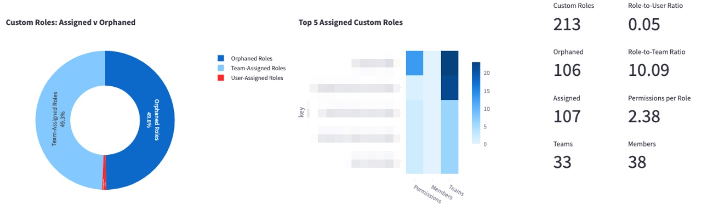
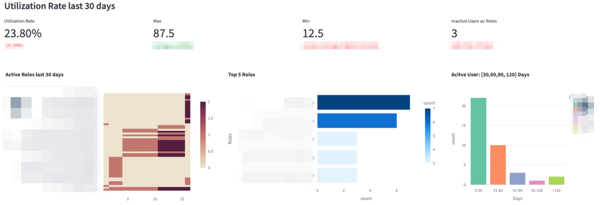

# LaunchDarkly RBAC Policy Explorer

This Python-based Streamlit app allows users to analyze Role-Based Access Control (RBAC) policies in LaunchDarkly, generating comprehensive operational, security, and core RBAC metrics to evaluate their management and effectiveness.

## Features
- **Role-Based Access Control (RBAC) Analysis**:
  - Analyze and visualize RBAC policies in LaunchDarkly.
  - Generate operational, security, and core RBAC metrics.

- **Custom Role Metrics**:
  - Track the total number of custom roles.
  - Identify and count orphaned (unassigned) roles.
  - Measure the assignment of roles to members and teams.
  - Calculate role-to-user and role-to-team ratios.
  - Determine the average number of permissions per policy.

- **Member Activity Metrics**:
  - Calculate the role utilization rate, indicating the percentage of users actively using their roles.
  - Identify inactive users who still have active custom roles.
  - Track role activity over the last 30 days, showing days since last seen.
  - Highlight the top 5 roles assigned to members and inherited from teams.
  - Provide counts of active users over various time frames (30, 60, 90, 120, >120 days).

- **Data Management**:
  - Save and load LaunchDarkly payloads and transformed data.
  - Toggle between reading local data and fetching data from the LaunchDarkly API.
### Operational Metrics
**Custom Roles**


| Metric                  | Description                                  |
| ----------------------- | -------------------------------------------- |
| Custom roles            | Total custom roles                           |
| Orphaned roles          | Total unassigned custom roles                |
| Assigned roles          | Total assigned member and Teams roles        |
| Role/User ratio         | Average number of roles assigned to a member |
| Role/Team ratio         | Average number of roles assigned to Teams    |
| Permission/Policy ratio | Average number of permissions per policy     |

**Account Members**


| Metric                    | Description                                                                   |
| ------------------------- | ----------------------------------------------------------------------------- |
| Role Utilization Rate     | Percentage of users actively utilizing the permissions granted by their roles |
| Inactive User w/ Roles    | Inactive users with active custom roles                                       |
| Active Roles last 30 days | Show role activities in the last 30 days. Y-Axis is the days since last seen  |
| Top 5 Roles               | Total count per role assigned to members and inherited from Teams             |
| Active Users              | Total active users: 30, 60, 90, 120, >120 days                                |


## Requirements

- Python 3.7 or higher
- Streamlit
- Pandas
- LaunchDarkly access token (READ only)

## Installation

1. **Clone the repository**:
    ```sh
    git clone git@github.com:tanben/ld-rbac-explorer.git
    cd ld-rbac-explorer
    ```

2. **Set up a virtual environment and install dependencies**:
    ```sh
    python3 -m venv .venv
    source .venv/bin/activate
    pip3 install -r requirements.txt
    ```

    **NOTE:** If you encounter missing module errors after `pip3 install`, deactivate and then reactivate your virtual environment:
    ```sh
    deactivate
    source .venv/bin/activate
    ```

3. **Configure LaunchDarkly API credentials**:
    - Create a `.env` file in the root directory of the project using this template:
        ```
        DEBUG=false
        SAVE_DATA=false
        READ_LOCAL=false
        LD_API_KEY=<your_launchdarkly_api_key> 
        ```

    **Configuration Options:**
    - `SAVE_DATA`: Set to `true` to save the LaunchDarkly payload and transformed data.
    - `READ_LOCAL`: Set to `true` to read local transformed data, or `false` to fetch data from the LaunchDarkly REST API endpoint.
    - `LD_API_KEY`: (Optional) If defined, this will prepopulate the API input field.

    **NOTE:** If you are running inside VSCode, kill the terminal running Streamlit to reload the `.env` file.

4. **Disable Streamlit usage stats (Optional)**:
    - Create the `config.toml` file in the `.streamlit` directory. Refer to [Streamlit Configuration Options](https://docs.streamlit.io/develop/api-reference/configuration/config.toml) for available configurations:
        ```
        [browser]
        gatherUsageStats = false
        ```

## Usage

1. **Run the Streamlit application**:
    ```sh
    streamlit run app.py
    ```

2. **Access the application**:
    - Open your web browser and go to `http://localhost:8501`.

## Contributing

Contributions are welcome! Please fork the repository and submit a pull request.